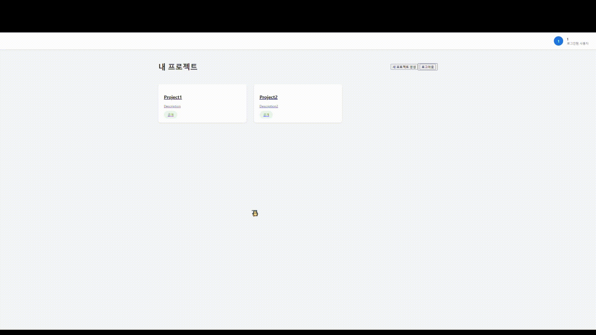
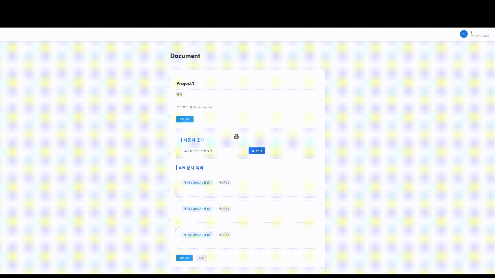
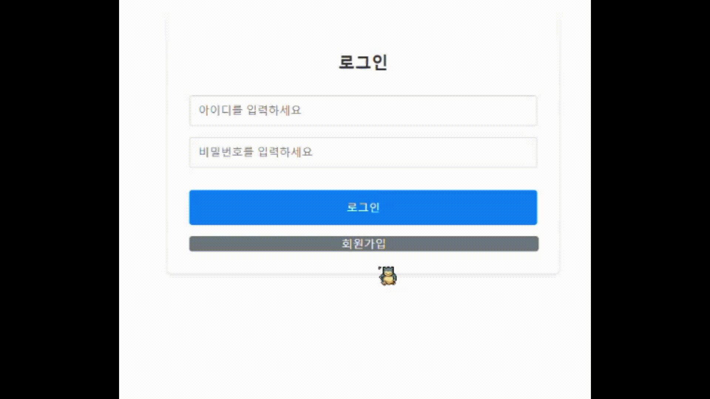
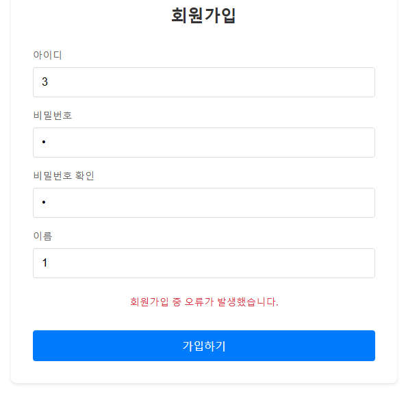
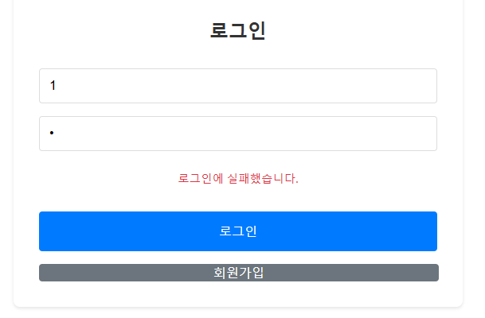
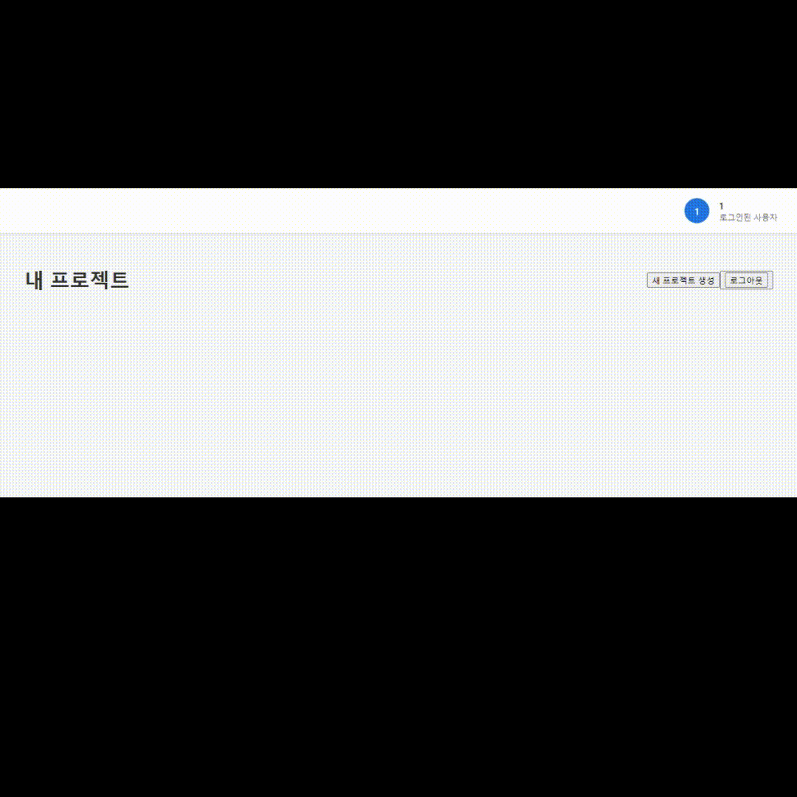
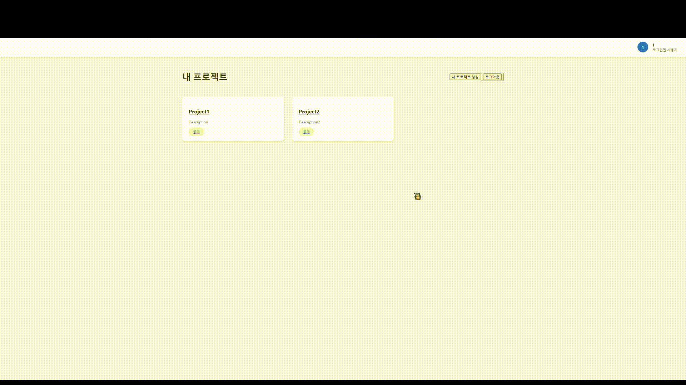
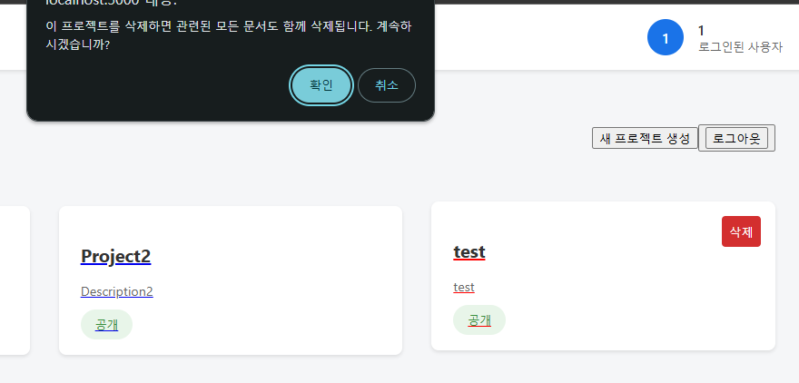
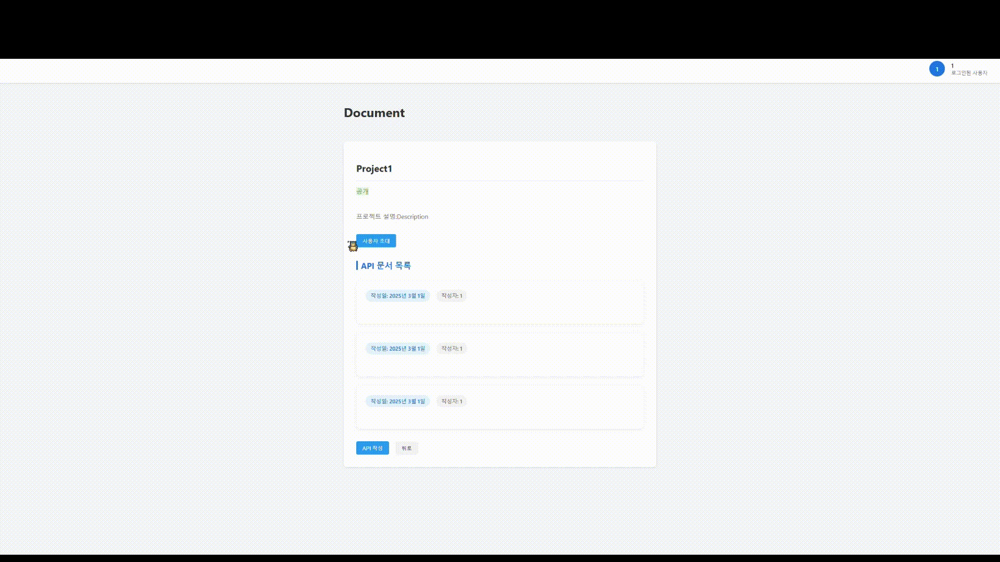
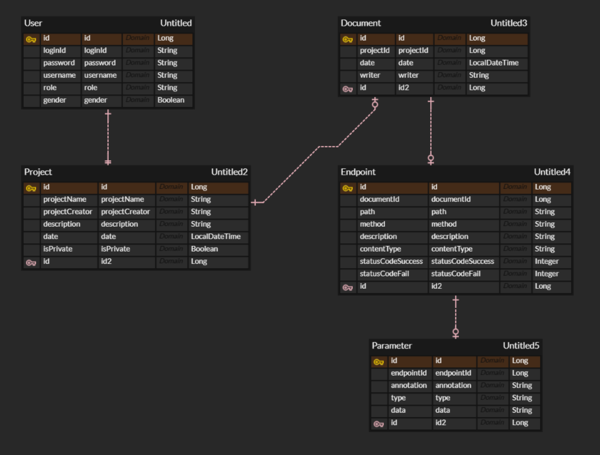

# 🐩 Project APi 문서 수기 작성

## 소개

 - 프로젝트 진행 시 API문서를 공유할 수 있는 기능을 구현해보았다.
 - 공개, 비공개 프로젝트를 설정할 수 있다.
 - Spring에서 Swagger를 통해 API문서를 쉽게 생성하고 공유할 수 있지만 수기로 작성하는 부분도 좋아 간단히 만들어 보았다.
 - API의 엔드포인트 정보, 파라미터 정보, 응답 정보, 모델 정보를 그룹화되어 볼 수 있다.
 - JWT로그인을 통해 다른 프로젝트 인원을 초대하고 문서를 작성 할 수 있어, 시간대별로 수정 사항을 볼 수 있다.

<br>

## 1. 개발 스택

<h3 align="center">Backend</h3>

<div align="center">
  
  
  
  
  
  
</div>

<br>

## 2. 브랜치 전략

- 단일 브랜치 전략으로 main 브랜치만으로 개발을 진행했다.
- 모든 개발 작업과 배포가 main 브랜치에서 직접 이루어졌다.
    - main 브랜치는 개발과 배포를 모두 담당하는 단일 브랜치로 사용되었다.
    - 직접적인 코드 변경과 커밋을 main 브랜치에 수행하여 신속한 개발 사이클을 구현했다.
    - 간결한 프로젝트 구조와 빠른 피드백을 위해 별도의 보조 브랜치 없이 작업했다.

<br>

## 3. 페이지별 기능

### [프로젝트 피드 & 문서 피드]
 - 유저의 프로젝트들이 보여진다.
 - 우측 상단의 프로젝트 생성 버튼으로 프로젝트를 생성할 수 있고, 프로젝트 조회 시 프로젝트의 API문서들을 볼 수 있다.
 - 프로젝트에 참여할 인원을 초대할 수 있다.



### [회원가입 & 로그인]
- 아이디, 비밀번호, 이름을 입력하면 가입할 수 있다.



<br>

### [회원가입 실패 & 로그인 실패]
- 아이디와 비밀번호를 입력하면 입력창에서 유효성 검사를 통해 통과하지 못 할 경우 경고 문구가 나타난다.
- 아이디 형식이 유효하지 않거나 비밀번호가 틀렸을 경우에는 하단에 경구 문구가 나타난다.
- 로그인에 성공하면 프로젝트 페이지로 이동한다.

| 회원가입 실패 | 로그인 실패 |
|----------|----------|
|||

<br>

### [로그아웃]
- 우측 상단의 로그아웃 버튼을 클릭하면 로그아웃이 진행됩니다.
- 로그아웃시 TOKEN을 반납하고 초기화면으로 이동하게 된다.
  
|로그아웃|
|--------|
||

### [프로젝트]

#### 1. 프로젝트 작성
- 모든 항목이 입력되면 프로젝트를 생성한다.

| 프로젝트 생성 |
|----------|
||

<br>

#### 2. 프로젝트 삭제
- 게시글 삭제 버튼 클릭 시, 게시글을 삭제하고 페이지를 리렌더링하여 삭제된 내용을 페이지에 반영합니다.

| 프로젝트 삭제 |
|----------|
||

<br>

### [API 문서]

#### 1. 문서 작성
- 모든 항목이 입력되면 API 문서를 생성한다.
- 파라미터, 엔드포인트를 추가할 수 있다.

| 문서 생성 |
|----------|
||

<br>

## 4 ERD

<br>

## 5. 프로젝트 구조

### [Backend]
```
└──src
  └──main
    └──java
      └──document.apidocument
        └──config
          └──SecurityConfig
        └──controller
          └──AuthController
          └──GlobalExeptionHandler
          └──DocumentController
          └──ProjectController
        └──domain
          └──Document
          └──Endpoint
          └──Parameter
          └──Project
          └──User
        └──dto
          └──document
            └──DocumentReqeust
            └──EndpointRequest
            └──ParameterRequest
          └──login
            └──LoginRequest
            └──SignupRequest
            └──TokenResponse
          └──project
            └──ProjectRequest
          └──exception
            └──DocumentNotFoundException
        └──repository
          └──DocumentRepository
          └──ProjectRepository
          └──UserRepository
        └──security.jwt
          └──JwtAuthenticationFilter
          └──JwtTokenProvider
        └──service
          └──DocumentService
          └──ProjectService
          └──UserService
      └──ApidocumentApplication
    └──resources
      application.yml
  └──test
```

<br>
